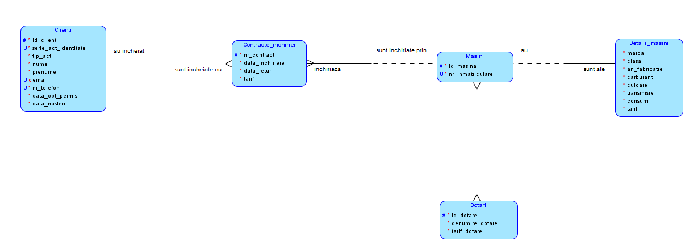
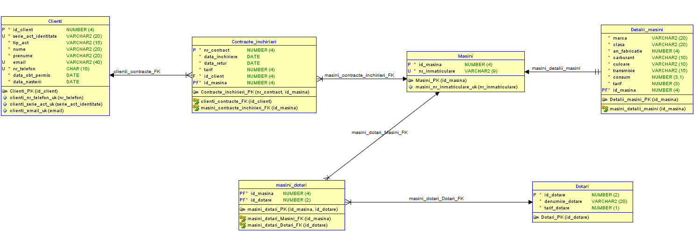

# RENT-A-CAR
## Titlu proiect : Evidența autoturismelor într-o firmă de închirieri auto
Analiza, proiectarea și implementarea unei baze de date care să modeleze activitatea unei firme de închirieri auto. 

## Descrierea proiectului
    
Informatiile de care avem nevoie sunt  legate de: mașinile pe care le deține firma, dotările care pot adăugate unei mașini, clienții, contractul de închiriere. 

În prima parte vom avea nevoie de informațiile legate de mașinile pe care le deține firma: fiecare mașină este identificată printr-un id, are un număr de înmatriculare și fiecărei mașini îi corespunde o serie de detalii (marca, clasa, anul fabricației, tipul de carburant, culoarea, tipul transmisiei, consumul și tariful mașinii), date care sunt utile pentru un client atunci cand acesta dorește să aleagă o mașină. Unei mașini îi pot fi adăugate diferite dotări iar fiecare dotare este identificată printr-un id, are o denumire (scaun copil, gps, lanțuri zapadă) și un tarif. 
    
În a doua parte ne vom ocupa de închirierea propriu-zisă. Pentru închiriere avem nevoie de informații referitoare la clienți și la contractul de închiriere. 

Fiecare persoană care dorește să închirieze o mașină este identificată printr-un id, are o serie a actului de identitate care este unică, nume, prenume, data nașterii, data obținerii permisului de conducere. Pe lângă datele sale personale, mai este nevoie obligatoriu de un număr de telefon și opțional de o adresă de email pentru ca persoana respectivă să poată fi contactată. 

După ce clientul s-a hotărât de ce mașină are nevoie următorul pas este contractul de închiriere care conține date referitoare la perioada de inchiriere (data la care se face închirierea și data la care se returnează mașina) precum si costul total, pe toată perioada pe care este închiriată mașina care este calculat în funcție de perioada de închiriere, de mașina aleasă și de dotările care sunt adăugate mașinii.

## Descrierea funcțională a aplicației

Principalele funcţii ale aplicației sunt:
 * Evidenţa mașinilor pe care le deține firma 
 * Evidenţa clienţilor
 * Evidenţa închirierilor efectuate 
 
## Structura și inter-relaționarea a tabelelor

**Tablele**  din aceasta aplicatie sunt: 
 * clienți; 
 * contracte_inchirieri; 
 * mașini; 
 * detalii_mașini;
 * dotări; 
 * mașini_dotări;
 
 În proiectarea acestei baze de date s-au identificat tipurile de relații 1:1, 1:n și n:n.
 Între tabelele **Masini** și **Dotari** se întâlnește o relație de tip many-to-many (n:n) deoarece o mașină poate să aibă mai multe dotari iar aceeași dotare poate să fie prezentă la mai multe mașini în același timp. Aceasta relație se va sparge în două, rezultând două relații 1:n și legatura între cele două tabele se va realiza cu ajutorul unei alte tabele **masini_dotari** care va conține cheia primară a fiecarei din cele două tabele. Atfel spus legatura se face prin două câmpuri **id_masina** și **id_dotare** reunite într-o tabelă comună
 
 Între tabela**Clienti** și tabela **Contracte_inchirieri** se stabilește o legătură 1:n. Un client poate închiria una sau mai multe mașini (adică poate avea unul sau mai multe contracte) dar aceeași mașină nu poate fi închiriată de mai mulți clienți în același timp. Legătura între cele două tabele se face prin campul **id_client**. 

 De asemenea tabela **Masini** stabilește o relație de tip 1:n cu tabela **Contracte_inchirieri** deoarece o mașină va fi închiriată de-a lungul timpului de mai multe ori. Legătura între cele două tabele se face prin campul **id_masina**.
 
 Între tabelele **Masini** și **Detalii_masini** se intâlnește o relație de tip 1:1 deoarece 
nu putem avea două detalii pentru aceeași mașină. Legătura între cele două tabele 
se face prin campul **id_masina**.

## Modelul logic

## Modelul relațional 

## Descrierea constrângerilor folosite
Constrângerile de tip check se găsesc aproape în toate tabelele. Are loc verificarea dimensiunii valorii introduse pentru atributele *marca, clasa, culoare,denumire_dotare, nume, prenume* pentru a nu putea introduce în baza de date, în cazul unei erori de scriere, variabile care au lungimea de un caracter.  
Constangerile de tip check sunt folosite și pentru verificarea formatului pentru *numarul de telefon* al clientului (astfel încât prima cifră să fie 0 iar a doua cifră să fie 7,2 sau 3 (numere de telefon fix sau mobil)),  pentru *nume, prenume, marca, clasa, culoare, denumire_dotare* (astfel încât să poată fi introduse doar litere),  pentru *email* (astfel încât să conțină obligatoriu litere sau cifre, ”@” și ” .”), pentru *numarul de înmatriculare* (să fie perimse unul sau două caractere pentru prescurtarea județului, două sau trei cifre și trei litere iar lungimea să fie egală cu 9). Atunci când se introduce variabila *carburant*, aceasta are voie să ia o valoare din lista constrângerii impuse: “motorină” sau “benzină”. De asemenea pentru variabila *transmisie* se poate alege doar dintre ”manuala” și ”automată”. În tabele există și variabile care pot lua valori doar între anumite intervale: *consumul* poate fi doar între 3 litri/100 km și 15 litri/ 100 km, *data_inchiriere* poate fi minim o zi și maxim 30 de zile, *an_fabricatie* poate fi între 2010 și 2020 (toate mașinile pe care 
le deține firma au anul de fabricație în această perioadă), *tarif_dotari* poate fi minim 3 euro și maxim 5 euro. Pentru *tarif* (din tabela detalii_masini, unde este trecut tariful pentru închirierea timp de o zi a unei mașini) este stabilită o constângere pentru ca acesta să nu poată lua valori mai mici de 10 euro. Pentru *data_retur* este stabilită o constrângere astfel încât aceasta să fie mai mare decât *data_inchiriere* iar *data_inchiriere* trebuie să fie mai mare decât 01.10.2020 deoarece firma își începe activitatea la această dată. Pentru *data_obt_permis* este stabilită o constrângere astfel încât aceasta să fie mai mare sau egală cu 18 ani decât *data_nasterii*.

Sunt folosite și constrangeri de tip unic pentru atributele *nr_inmatriculare* (pentru a nu putea exista două mașini cu același număr de înmatriculare), *nr_telefon, email, serie_act_identitate* ( pentru că nu putem avea doi clienți cu același număr de telefon/email/serie_act_identitate).

Pe lângă aceste constrângeri sunt folosite și triggere pentru a verifica *data nașterii* unui client (un client trebuie să aibă 21 de ani la momentul închirierii) și *data obținerii permisului de conducere* (clientul trebuie să aibă permisul de conducere de cel puțin un an pentru a putea închiria o mașină). De asemenea este folosit un 
trigger pentru a verifica faptul că nu putem avea aceeași mașină închiriată de două ori în aceeași perioadă. 

Constrângerile de tip not null se găsesc pe toate atributele mai puțin pe atributul *email* din tabela clienti. 

Primary key-urile sunt generate de baza de date printr-un mecanism de tip autoincrement (*id_client* din *clienti*, *nr_contract* din *contracte_inchirieri*, *id_masina* din *masini*, *id_dotare* din *dotari*).
